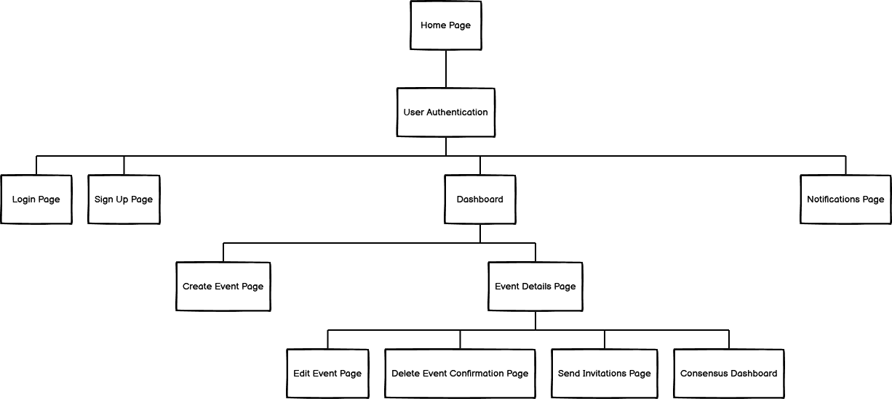

# Project Overview

- Social Event Planner

## Project Name:

- PlanPal

### Project Description:

- PlanPal is a web-based application that helps groups of friends plan social events. Users can propose event ideas, invite friends, gather availability feedback through polling, and finalize event details based on group consensus.

### User Stories:

<!-- TODO - Create table of user stories -->

User Story 1: User Authentication

User Story 2: Event Creation

User Story 3: Invitation System

User Story 4: Availability Polling

User Story 5: Consensus Building

User Story 6: Notification System

User Story 7: Dashboard

### Wireframes:

#### Site Map

