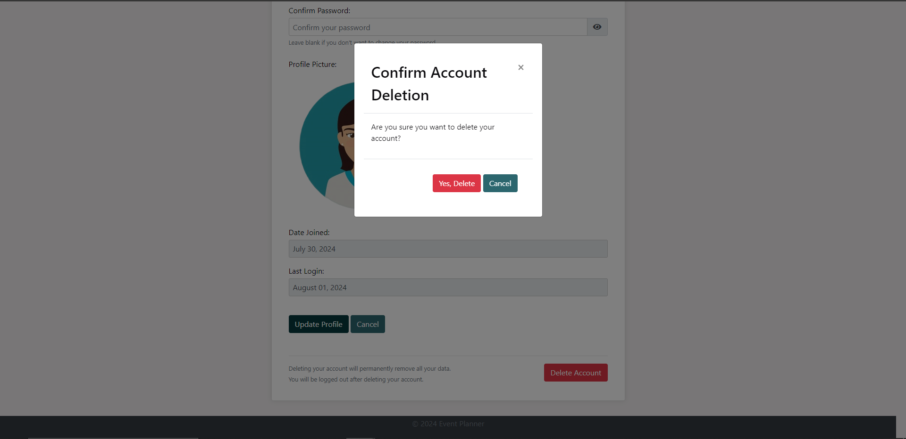
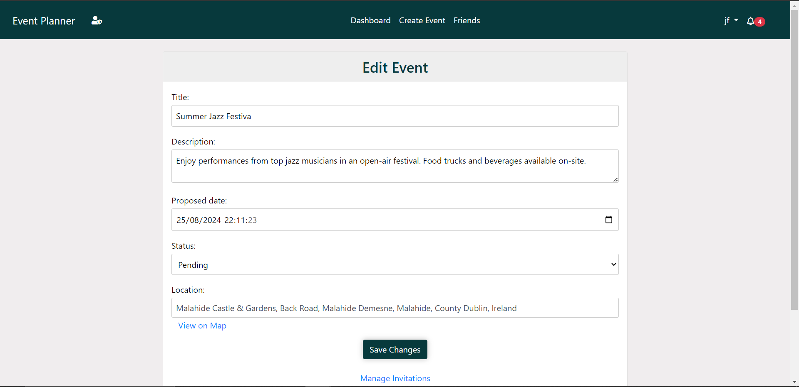
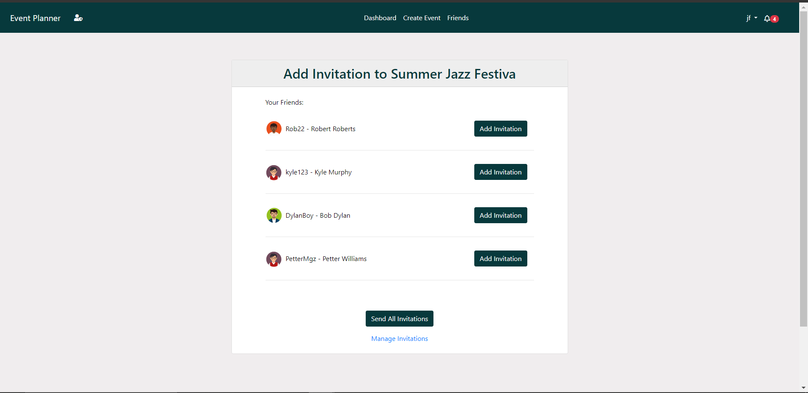
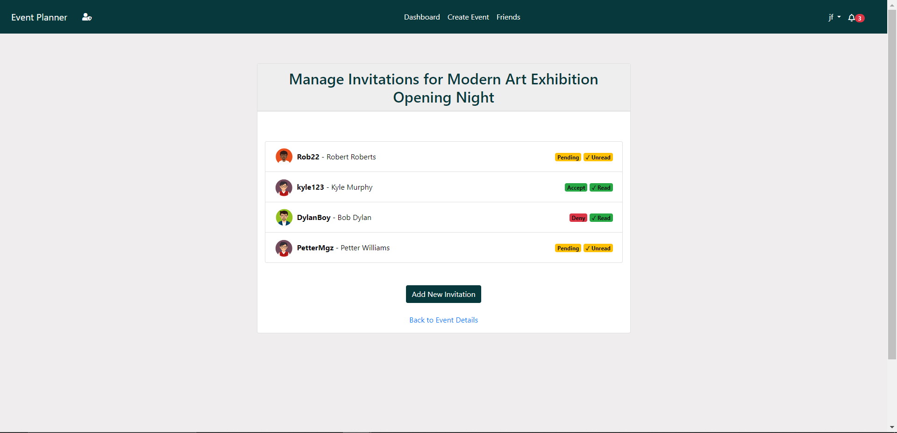
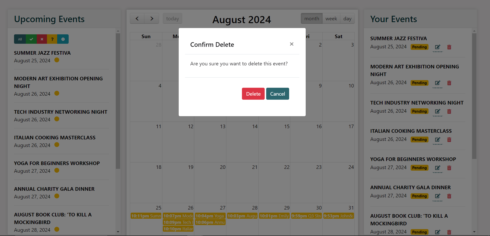
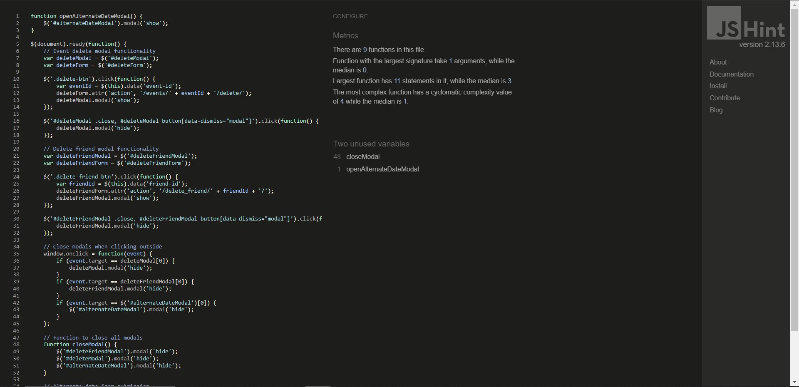
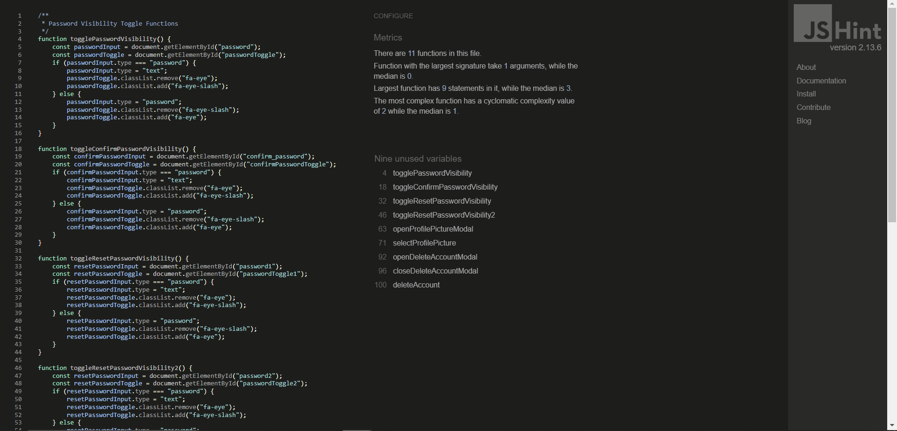
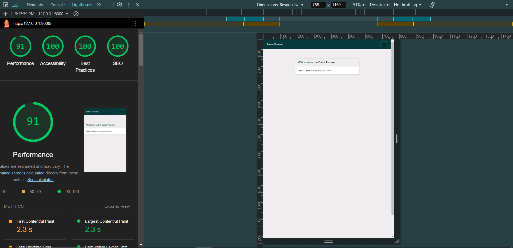
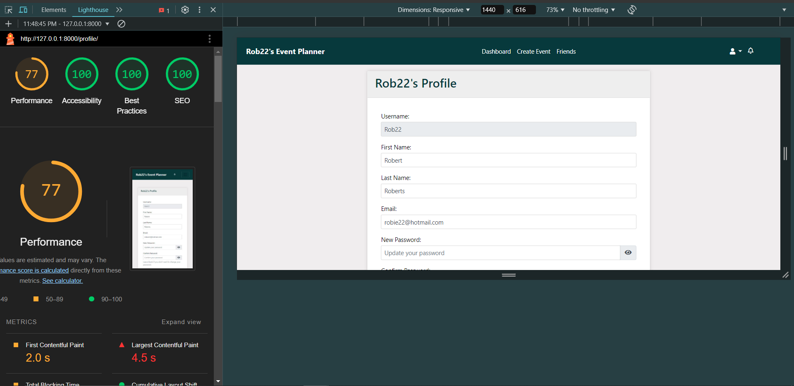

# [PlanPal - Social Event Planner](https://planpal-1fe5e3919654.herokuapp.com/)
<a href="https://planpal-1fe5e3919654.herokuapp.com/">
  
</a>


### Introduction

- Social Event Planner is a web application designed to help users create, manage, and share events with their friends. It provides features for event creation, invitations, notifications, and user profile management.

View the live project [here](https://planpal-1fe5e3919654.herokuapp.com/)

## Table of Contents
TODO - Update table of contents
1. [Introduction](#introduction)
2. [Technologies Used](#technologies-used)
   - [Django](#django)
   - [SQLite](#sqlite)
   - [Bootstrap](#bootstrap)
   - [jQuery](#jquery)
   - [FullCalendar](#fullcalendar)
   - [Google Places API](#google-places-api)
   - [Font Awesome](#font-awesome)
   - [Ajax](#ajax)
   - [Tippy.js](#tippyjs)
   - [Moment.js](#momentjs)
   - [Heroku](#heroku)
   - [SendGrid](#sendgrid)
3. [User Stories](#user-stories)
   - [User Story 1: User Authentication](#user-story-1-user-authentication)
   - [User Story 2: Event Creation](#user-story-2-event-creation)
   - [User Story 3: Invitation System](#user-story-3-invitation-system)
   - [User Story 4: Availability](#user-story-4-availability)
   - [User Story 5: Friendship System](#user-story-5-friendship-system)
   - [User Story 6: Notification System](#user-story-6-notification-system)
   - [User Story 7: Dashboard](#user-story-7-dashboard)
   - [User Story 8: Profile Management](#user-story-8-profile-management)
4. [Wireframes](#wireframes)
   - [Site Map](#site-map)
   - [Database Schema](#database-schema)
5. [Features](#features)
   - [User Authentication](#user-authentication)
   - [Event Creation and Management](#event-creation-and-management)
   - [Invitation System](#invitation-system)
   - [Notification System](#notification-system)
   - [Friend Management](#friend-management)
   - [Calendar Integration](#calendar-integration)
   - [Location Services](#location-services)
   - [User Dashboard](#user-dashboard)
   - [Dynamic Data Integration](#dynamic-data-integration)
   - [Error Handling](#error-handling)
   - [Responsive Design](#responsive-design)
   - [Security Features](#security-features)
   - [Additional Features](#additional-features)
6. [MoSCoW Prioritization](#moscow-prioritization)
   - [Must Have](#must-have)
   - [Should Have](#should-have)
   - [Could Have](#could-have)
   - [Won't Have (for now)](#wont-have-for-now)
6. [GitHub Projects, Milestones, and Issues](#github-projects-milestones-and-issues)
   - [GitHub Projects](#github-projects)
   - [Milestones](#milestones)
   - [Issues](#issues)
6. [Troubleshooting](#troubleshooting)
   - [Password Reset](#password-reset)
7. [Testing](#testing)
   - [Test Cases](#test-cases)
     - [Accounts App](#accounts-app)
     - [Invitations App](#invitations-app)
     - [Notifications App](#notifications-app)
     - [Example Test Cases](#example-test-cases)
   - [Validator Testing](#validator-testing)
     - [flake8](#flake8)
     - [CI Python Linter](#ci-python-linter)
   - [Manual Testing](#manual-testing)
8. [Bugs](#bugs)
   - [Google Sheets Not Opening in a New Tab (Deployment Issue)](#google-sheets-not-opening-in-a-new-tab-deployment-issue)
   - [Fixed Bugs](#fixed-bugs)
     - [Trail slash in the URL](#trail-slash-in-the-url)
9. [UI Improvements](#ui-improvements)
   - [Implementation of the colorama Library](#implementation-of-the-colorama-library)
10. [Future Improvements](#future-improvements)
   - [Google Maps JavaScript API](#google-maps-javascript-api)
11. [Setup](#setup)
    - [Prerequisites](#prerequisites)
    - [Installation](#installation)
    - [Usage](#usage)
12. [Deployment](#deployment)
    - [Cloning & Forking](#cloning--forking)
    - [Local Deployment](#local-deployment)
    - [Remote Deployment (Heroku)](#remote-deployment-heroku)
13. [Credits](#credits)
    - [Source Code](#source-code)
    - [Images](#images)
    - [Useful links](#useful-links)
14. [License](#license)

## Technologies Used

- [Django](https://www.djangoproject.com/)
- [SQLite](https://www.sqlite.org/)
- [Bootstrap](https://getbootstrap.com/)
- [jQuery](https://jquery.com/)
- [FullCalendar](https://fullcalendar.io/)
- [Google Places API](https://developers.google.com/maps/documentation/places/web-service/overview)
- [Font Awesome](https://fontawesome.com/)
- [Ajax](https://api.jquery.com/jquery.ajax/)
- [Tippy.js](https://atomiks.github.io/tippyjs/)
- [Moment.js](https://momentjs.com/)
- [Heroku](https://www.heroku.com/)
- [SendGrid](https://sendgrid.com/)


### Django
Django is a high-level Python web framework that encourages rapid development and clean, pragmatic design. It is used to build the server-side functionality of the Social Event Planner, including handling HTTP requests, database operations, and user authentication.

### SQLite
Django's built-in SQLite is used as the database for this project. It is a lightweight, disk-based database that doesn’t require a separate server process, making it easy to set up and use.

### Bootstrap
Bootstrap is a front-end framework for developing responsive and mobile-first websites. It provides CSS and JavaScript-based design templates for typography, forms, buttons, navigation, and other interface components.

### jQuery
jQuery is a fast, small, and feature-rich JavaScript library. It simplifies things like HTML document traversal and manipulation, event handling, and animation, making it easier to develop dynamic and interactive web pages.

### FullCalendar
FullCalendar is a JavaScript calendar library for creating interactive and customizable calendars. It is used to display events in a calendar view, allowing users to see their schedules at a glance.

### Google Places API
The Google Places API is a service that returns information about places using HTTP requests. It is used to enhance event location input by providing autocomplete functionality and additional place details.

### Font Awesome
Font Awesome is a font and icon toolkit based on CSS and LESS. It is used to add scalable vector icons that can be customized with CSS.

### Ajax
Ajax is used to perform asynchronous HTTP requests to update parts of a web page without reloading the whole page. It enhances the user experience by providing faster and more dynamic interactions.

### Tippy.js
Tippy.js is a lightweight, highly customizable tooltip and popover library. It is used to display additional information about events when users hover over them in the calendar.

### Moment.js
Moment.js is a JavaScript library for parsing, validating, manipulating, and displaying dates and times. It is used in conjunction with FullCalendar to handle date and time formatting.

### Heroku
Heroku is a cloud platform as a service (PaaS) that enables developers to build, run, and operate applications entirely in the cloud. It is used to deploy and host the Social Event Planner web application.

### SendGrid
SendGrid is a cloud-based email service that provides reliable email delivery and scalability. It is used to send transactional emails, such as password reset links and event invitations, to users of the Social Event Planner.

## User Stories:

### User Story 1: User Authentication
| As a user...                                                                                                                             | I know I'm done when...                                   |
| ---------------------------------------------------------------------------------------------------------------------------------------- | --------------------------------------------------------- |
| I want to sign up for the event planner platform                                                                                         | I have successfully created an account and logged in     |
| I want to log in to my account                                                                                                           | I can access my dashboard with my user credentials        |
| I want to log out of my account                                                                                                          | I am redirected to the homepage and my session is ended   |

### User Story 2: Event Creation

| As a user...                                                                                                                             | I know I'm done when...                                   |
| ---------------------------------------------------------------------------------------------------------------------------------------- | --------------------------------------------------------- |
| I want to create a new event                                                                                                             | I have filled in the event details and it appears on my calendar and event list |
| I want to edit an event I created                                                                                                        | I can update the event details and see the changes reflected |
| I want to use Google Places Autocomplete for event location                                                                              | I can easily select a location using autocomplete suggestions |
| I want to delete an event I created                                                                                                      | The event is removed from my event list and calendar     |

### User Story 3: Invitation System
| As a user...                                                                                                                             | I know I'm done when...                                   |
| ---------------------------------------------------------------------------------------------------------------------------------------- | --------------------------------------------------------- |
| I want to invite friends to my event                                                                                                     | My friends receive an invitation and can RSVP            |
| I want to select friends from a list to send invitations                                                                                 | I can easily choose friends from my friend list to invite |
| I want to accept an event invitation                                                                                                     | My RSVP status is updated to 'Accepted'                  |
| I want to decline an event invitation                                                                                                    | My RSVP status is updated to 'Declined' and the event is grayed out |
| I want to see the status of my event invitations                                                                                         | I can see who has accepted, declined, or not responded to my invitations |
| I want to manage invitations and see who has viewed and responded                                                                        | I can track invitation views and responses in real-time  |


### User Story 4: Availability
| As a user...                                                                                                                             | I know I'm done when...                                   |
| ---------------------------------------------------------------------------------------------------------------------------------------- | --------------------------------------------------------- |
| I want to see the availability of other users for an event                                                                               | I can view the availability of invited users for an event |
| I want to suggest alternate dates for events                                                                                             | I can propose new dates for events and see responses     |

### User Story 5: Friendship System
| As a user...                                                                                                                             | I know I'm done when...                                   |
| ---------------------------------------------------------------------------------------------------------------------------------------- | --------------------------------------------------------- |
| I want to search for friends on the platform                                                                                             | I can find and send friend requests to other users       |
| I want to accept or decline friend requests                                                                                              | I can manage incoming friend requests from other users   |
| I want to see a list of my friends                                                                                                       | All my friends are displayed in a list with their profile pictures |
| I want to view a friend's profile                                                                                                        | I can click on a friend and see their profile details     |
| I want to remove a friend                                                                                                                | The friend is removed from my friend list                 |
| I want to confirm before removing a friend                                                                                               | A confirmation modal appears when I attempt to remove a friend |
| I want to see a list of sent friend requests                                                                                             | I can track all the friend requests I have sent          |
| I want to see a list of received friend requests                                                                                         | I can view and manage all the friend requests I have received |

### User Story 6: Notification System
| As a user...                                                                                                                             | I know I'm done when...                                   |
| ---------------------------------------------------------------------------------------------------------------------------------------- | --------------------------------------------------------- |
| I want to see notifications of new events or updates                                                                                     | New notifications appear in my notification dropdown     |
| I want to mark a notification as read                                                                                                    | The notification is marked as read and the unread count decreases |
| I want to see all my notifications                                                                                                      | I can view a list of all my past notifications            |
| I want to receive real-time updates for new notifications                                                                                | I get alerts and the notification count updates without refreshing the page |


### User Story 7: Dashboard
| As a user...                                                                                                                             | I know I'm done when...                                   |
| ---------------------------------------------------------------------------------------------------------------------------------------- | --------------------------------------------------------- |
| I want to see a list of my upcoming events                                                                                                | All my future events are displayed in the upcoming events list |
| I want to see a list of events I have created                                                                                            | All events I have created are displayed in a separate list |
| I want to view past events                                                                                                               | Past events are visible on my calendar                    |
| I want to see a calendar view of all events                                                                                              | All events I am invited to or have created are displayed on the calendar |
| I want to see tooltips with event details when hovering over calendar events                                                             | Tooltips appear with event details when I hover over events on the calendar |
| I want to see a loading spinner while event details tooltip loads                                                                        | A spinner is displayed while event details are being loaded |
| I want to view the details of an event                                                                                                   | I can click on an event and see all its details          |
| I want to see color-coded event statuses                                                                                                 | Different event statuses are displayed in various colors for easy identification |
| I want to edit and delete events I have created                                                                                         | I can modify or remove my events directly from the dashboard |
| I want to confirm before deleting an event                                                                                              | A confirmation modal appears when I attempt to delete an event |


### User Story 8: Profile Management
| As a user...                                                                                                                             | I know I'm done when...                                   |
| ---------------------------------------------------------------------------------------------------------------------------------------- | --------------------------------------------------------- |
| I want to manage my profile information                                                                                                  | I can update my profile details and profile picture      |
| I want to change my password                                                                                                             | I can update my password and log in with the new credentials |
| I want to reset my password if I forget it                                                                                               | I can request a password reset via email  
| I want to delete my account                                                                                                              | My account is permanently deleted and all data is removed |


## Wireframes:

#### Site Map
- The site map visually outlines the structure of the website, showing the relationships between different pages and sections. It provides an overview of how users will navigate through the platform, ensuring an intuitive user experience.


#### Database Schema
- The database schema diagram illustrates the data model used in the application. It includes the tables, their relationships, and key fields, ensuring data integrity and efficient data management.


#### color palette
- The color palette is used to define the primary and secondary colors of the application. It helps maintain a consistent visual style and branding throughout the platform.

   - Coolors.co was used to generate the color palette for the application.

## Features
TODO - Add features screenshots

#### User Authentication
- Sign Up: Users can create a new account using their email address and a password.
   
- Login: Registered users can log in using their email and password.
   
- Logout: Users can securely log out of their accounts.
   
- Password Reset: Users can reset their password via email if they forget it.
   
- Account Management: Users can update their profile information, including changing their password.
   
   
   

#### Event Creation and Management
- Create Event: Users can create new events by providing details such as title, date, time, location, and description.
   
- Edit Event: Users can edit the details of their events.
   
- Delete Event: Users can delete their events, which will also delete all associated invitations and responses.
- View Event Details: Users can view detailed information about an event, including the list of invited participants and their responses, and suggested dates/times.
   

#### Invitation System
- Send Invitations: Event creators can invite friends to their events.
   
- Manage Invitations: Users can view and manage invitations they have sent or received.
   
- Respond to Invitations: Invited users can accept, decline, or mark their response as "maybe".

#### Notification System
- Real-Time Notifications: Users receive notifications for event updates, invitations, and responses.
   
- Read/Unread Status: Notifications can be marked as read or unread.
- Notification Center: A dropdown menu shows the most recent notifications with links to relevant actions.
   

#### Friend Management
- Add Friends: Users can send friend requests to other users.
- Manage Friend Requests: Users can view and respond to incoming friend requests.
- View Friends: Users can view a list of their friends and access their profiles.
   
- Remove Friends: Users can unfriend someone from their friend list.
   

#### Calendar Integration
- Interactive Calendar: Events are displayed in a calendar view, allowing users to see their schedule at a glance.
- Event Tooltips: Hovering over an event shows a tooltip with detailed information about the event.
- Color-Coded Events: Events are color-coded based on their status (confirmed, pending, cancelled).
- Event Status Indicators: Additional indicators for user responses (accepted, declined, maybe).

#### Location Services
- Google Places Autocomplete: Integrated autocomplete for event location input, enhancing user experience and accuracy.

#### User Dashboard
- Upcoming Events: A list of upcoming events that the user is either hosting or invited to.
- Your Events: A separate list showing events created by the user.
- Event Management Tools: Quick access to edit or delete events from the dashboard.
   

#### Dynamic Data Integration
- Real-Time Data Updates: Notifications are dynamically updated without requiring a page refresh.
- Ajax Integration: Used for updating the notification count and notification dropdown without reloading the page.

#### Error Handling
- User-Friendly Error Messages: Clear and concise error messages are displayed for validation errors and other issues.
- Fallback Mechanisms: Ensures the application continues to function smoothly in case of minor issues.

#### Responsive Design
- Mobile-Friendly: The application is designed to be fully responsive and works well on mobile devices.
- Adaptive UI Elements: Elements such as dropdowns, modals, and forms adapt to different screen sizes for an optimal user experience.

#### Security Features
- CSRF Protection: Cross-Site Request Forgery protection is enabled to secure forms.
- Password Hashing: User passwords are securely hashed using Django’s built-in mechanisms.
SSL/TLS: Ensures data is encrypted during transmission.

#### Additional Features
- Progress Indicators: Loading spinners provide feedback during data fetching and processing.
- Reporting: Detailed reports on event participation and user activity.

## MoSCoW Prioritization
- The MoSCoW method is used to prioritize features based on their importance and urgency. Features are categorized into Must Have, Should Have, Could Have, and Won't Have for the current version of the application.

### Must Have

| Feature                          | Description                                                                                       |
|----------------------------------|---------------------------------------------------------------------------------------------------|
| User Authentication              | Users must be able to sign up, log in, and log out. Unique usernames and emails are required.     |
| Event Creation                   | Users must create new events with title, description, date, and location (Google Places API).     |
| Invitation System                | Users must invite friends to events and see invitation status. Friends must RSVP.                |
| Dashboard                        | Users must see upcoming, past events, calendar view, edit/delete events, color-coded status, and modals for deletion/alternate dates.  |
| Friendship System                | Users must search for friends, send friend requests, view friends’ profiles, and remove friends. Friends’ profile pictures must be shown. |
| Notification System              | Users must receive notifications for events, updates, and friend requests. Notifications must update in real-time with alerts. |
| Availability                     | Users must see friend availability for events and suggest alternate dates.                      |

### Should Have

| Feature                          | Description                                                                                       |
|----------------------------------|---------------------------------------------------------------------------------------------------|
| User Profile Management          | Users should update profile information, profile picture, change password, and reset password.    |
| Event Management                 | Users should suggest alternate event dates and see responses.                                     |
| Home Page                        | Should introduce the event planner platform and provide a call to action.                         |
| Error Handling                    | Users should see clear error messages for validation errors and other issues.                     |

### Could Have

| Feature                          | Description                                                                                       |
|----------------------------------|---------------------------------------------------------------------------------------------------|
| Advanced Search and Filtering    | Users could filter events by type, location, date range, and search by keyword.                   |
| Enhanced Notifications           | Users could receive email notifications and customize settings.                                   |
| Analytics and Reporting          | Users could view analytics on event participation and friend interactions.                        |

### Won't Have (for now)

| Feature                          | Description                                                                                       |
|----------------------------------|---------------------------------------------------------------------------------------------------|
| Integration with Social Media    | Integration for event sharing and friend invitations on social media platforms.                   |
| Monetization Features            | Features like paid events, ticketing, or advertisements.                                          |
| Gamification                     | Points, badges, or rewards for event participation and friend interactions.                       |
| Password Reset | Users can reset their password via email if they forget it. |

## GitHub Projects, Milestones, and Issues

### GitHub Projects
GitHub Projects was used to manage and organize tasks. It provides a Kanban-style board that allows to visualize our workflow and track the progress of tasks.

### Milestones
Milestones are used to track the progress of significant phases in our project. Each milestone includes a set of issues that need to be completed to achieve the milestone goal.

### Issues
Issues are used to track tasks, enhancements, and bugs for the project. Each issue is assigned to a team member and linked to a milestone.

For more details, visit the [GitHub Project](https://github.com/users/jeffdruid/projects/3) page.


## Troubleshooting
- Password Reset: Users can reset their password via email if they forget it.
   - ~~The password reset functionality is implemented using Django's built-in password reset views and templates. Users can request a password reset by entering their email address, and an email with a reset link will be sent to them. The link contains a unique token that allows users to set a new password. The password reset link is valid for a limited time and can only be used once.~~
   
   - This feature was replaced with an one time link sent to the user's email to reset their password.
   
   
   

## Testing
All testing was done manually and automated using Django's built-in testing framework. The application was tested for functionality, user experience, and security. Test cases were created to cover user stories and edge cases, ensuring the application works as expected.
<!-- TODO - Add link to test cases -->
### Testing User Stories

| Story ID | User Story Description                                          | Acceptance Criteria                                                                                                                                       |
|----------|-----------------------------------------------------------------|-----------------------------------------------------------------------------------------------------------------------------------------------------------|
| US01     | As a user, I want to sign up for an account                     | - The sign-up page loads correctly.<br>- Users can enter username, email, and password.<br>- User receives a confirmation email.<br>- User is logged in automatically after signing up. |
| US02     | As a user, I want to log in to my account                       | - The login page loads correctly.<br>- Users can enter username and password.<br>- User is redirected to the dashboard upon successful login.             |
| US03     | As a user, I want to reset my password                          | - The forgot password link is available on the login page.<br>- Users receive a one-time login link in their email.<br>- Users can set a new password.     |
| US04     | As a user, I want to view my profile                            | - The profile page loads correctly.<br>- Users can view their username, email, and profile picture.<br>- Users can update their profile information.       |
| US05     | As a user, I want to manage my events                           | - The dashboard shows all user-created and invited events.<br>- Users can filter events by status.<br>- Users can view details of each event.              |
| US06     | As a user, I want to invite friends to events                   | - Users can see a list of their friends.<br>- Users can send event invitations to friends.<br>- Users receive notifications for new invitations.           |
| US07     | As a user, I want to accept or decline friend requests          | - Users receive notifications for new friend requests.<br>- Users can accept or decline friend requests.<br>- Users can see a list of their friends.       |
| US08     | As a user, I want to send friend requests                       | - Users can search for other users.<br>- Users can send friend requests to other users.<br>- Users receive notifications for sent requests.                |
| US09     | As a user, I want to delete a friend                            | - Users can remove friends from their friend list.<br>- Associated data (notifications, invitations) are deleted.<br>- Users receive confirmation of removal. |
| US10     | As an event creator, I want to manage event invitations         | - Users can view a list of sent invitations.<br>- Users can see the status of each invitation.<br>- Users can resend or cancel invitations.                |
| US11     | As an admin, I want to manage user accounts                     | - Admins can view a list of all users.<br>- Admins can delete or deactivate user accounts.<br>- Admins can reset user passwords.                          |
| US12     | As a user, I want to receive notifications                      | - Users receive notifications for new events, invitations, and friend requests.<br>- Users can mark notifications as read.<br>- Unread notifications are highlighted. |

### Test Cases
- Unit tests were created to cover the core functionality of the application, including user authentication, event creation, invitations, notifications, and friend management. The tests ensure that the application works as expected and that new features do not introduce regressions.


#### Accounts App:

- Dashboard View: Ensures the dashboard loads correctly and displays the correct information.
- Signup View: Verifies that the signup process works correctly.
- Profile View: Confirms the profile view loads and updates correctly.
- Friends Page View: Checks that the friends page loads correctly.
- Send Friend Request: Ensures friend requests can be sent.
- Respond Friend Request: Validates the process of responding to a friend request.
- Delete Friend: Tests the deletion of friends.
- One-Time Login Link:
   - Sending the one-time login link.
   - Logging in using the one-time login link.
   - Handling expired tokens.
   - Ensuring invalid user IDs are handled gracefully.

#### Invitations App:

- Manage Invitations View: Verifies that event creators can manage invitations.
- Create Invitation View: Ensures event creators can invite friends and handle various scenarios (e.g., no friends, non-friends, duplicate invitations).

#### Notifications App:

- Notifications View: Ensures the notifications view loads correctly.
- Mark Notification Read: Confirms notifications can be marked as read and the correct redirection occurs.
- Get Notifications: Verifies that unread notifications are fetched correctly.

##### Example Test Cases
Here's an example of a test case for the one-time login link:

```python
def test_send_one_time_login_link(self):
    """Test to ensure the one-time login link is sent to the correct email."""
    print("Testing send one-time login link...")
    response = self.client.post(
        reverse("send_one_time_login_link_form"),
        {"email": self.user.email},
    )
    self.assertEqual(response.status_code, 302)
    self.assertEqual(len(mail.outbox), 1)
    self.assertIn("Your one-time login link for PlanPal", mail.outbox[0].subject)
    print("Send one-time login link tested successfully.")
```

- The test case sends a POST request to the `send_one_time_login_link_form` view with the user's email address.
- It checks that the response status code is 302 (redirect) and that an email is sent.
- The test asserts that the email subject contains the expected text.
- The test case is run as part of the test suite to ensure the one-time login link functionality works as expected.

### Validator Testing
#### W3C HTML Validator
- The W3C HTML Validator is used to check the HTML code for compliance with web standards.

#### W3C CSS Validator
- The W3C CSS Validator is used to check the CSS code for compliance with web standards.
   
   - W3C Web Validator extension in Visual Studio Code.
   

#### flake8
- Flake8 is a Python linting tool that checks the codebase for style and syntax errors.
   
   -  The flake8 tool was used to check the codebase for PEP8 compliance and syntax errors.

#### Jshint
- Jshint is a JavaScript code quality tool that helps identify errors and potential problems in JavaScript code.

| File | Results |
|------|---------|
| event_form.js |  |
| scripts.js |  |
| modals.js |  |
| profile.js |  |

#### CI Python Linter
- The CI Python Linter is a continuous integration tool that runs flake8 on the codebase to ensure it meets the required standards.

#### Django's Built-in Check System
Django provides a management command check that can help identify some issues within your project.
   ```bash
      python manage.py check
   ```
   -

#### WAVE - Web Accessibility Evaluation Tool
- WAVE is a web accessibility evaluation tool that helps identify accessibility issues in web pages.
     

#### LightHouse
- LightHouse is a tool for improving the quality of web pages. It provides audits for performance, accessibility, best practices, SEO, and progressive web apps.
   
   - The LightHouse extension in Google Chrome was used to audit the application for performance, accessibility, best practices, and SEO.
create a table with the results of the audit.

| From | Results | 
|-------------|---------------|
| Home         |  |
| Login        |  |
| Signup       |  |
| Password Reset|  |
| Logout       |  | 
| Dashboard    |  |
| TODO         |  |
| Profile      |  |
| Friends      |  |
| Notifications|  |
| Invitations  |  |
| Events       |  |
| Calendar     |  |
| Create Event |  |
| Edit Event   |  |
| Event Details|  |


### Manual Testing
- Manual testing is performed to verify the functionality of the application from a user's perspective.

## Bugs

## UI Improvements

## Future Improvements

#### Google Maps JavaScript API
- The Google Maps JavaScript API would be used to embed maps into the web pages and provide location-based services, such as displaying event locations on a map.

#### Dynamic Data Integration
- Real-Time Data Updates: Data on the dashboard, calendar, and event responses could be updated in real-time using WebSockets or other technologies.

#### Filtering and Sorting
- Enhanced Filtering: Users could filter events based on criteria such as date, location, or event type.
- Sorting Options: Additional sorting options could be added to the event list, such as by date, title, or status.

## Setup

### Prerequisites

- Python 3.9 or higher
- Django 4.2.13
- SendGrid account for email services
- Heroku CLI (for deployment)
- Git

### Installation

1. **Clone the repository**:
   ```bash
   git clone https://github.com/your-username/your-repo.git
   cd your-repo
Create a virtual environment:

```bash
python -m venv venv
```

Activate the virtual environment:

On Windows:
```bash
venv\Scripts\activate
```
On macOS and Linux:
```bash
source venv/bin/activate
Install the dependencies:
```

```bash
Copy code
pip install -r requirements.txt
Set environment variables:
Create a .env file and add the following environment variables:
```
```
makefile
Copy code
DEFAULT_FROM_EMAIL_KEY=your_email@example.com
EMAIL_HOST_PASSWORD_KEY=your_sendgrid_api_key
SECRET_KEY=your_secret_key
```

### Usage

Run the development server:

```bash
python manage.py runserver
```

Open your browser and go to http://127.0.0.1:8000/ to access the application.

## Deployment

### Cloning & Forking
Fork the repository on GitHub to your own account.

Clone the repository to your local machine:

```bash
git clone https://github.com/your-username/your-forked-repo.git
```

### Local Deployment

Run database migrations:


```bash
python manage.py migrate
```

Create a superuser:


```bash
python manage.py createsuperuser
```

Collect static files:

```bash
python manage.py collectstatic
Remote Deployment (Heroku)
```

Login to Heroku:

```bash
heroku login
Create a new Heroku app:
``

```bash
heroku create your-app-name
Set environment variables on Heroku:
```

```bash
heroku config:set DEFAULT_FROM_EMAIL_KEY=your_email@example.com
heroku config:set EMAIL_HOST_PASSWORD_KEY=your_sendgrid_api_key
heroku config:set SECRET_KEY=your_secret_key
```

### Remote Deployment (Heroku)

```bash
git push heroku main
Run database migrations on Heroku:
```

```bash
heroku run python manage.py migrate
```

Open your app:

```bash
heroku open
```

## Credits

- [Default Profile Picture SVG](https://en.m.wikipedia.org/wiki/File:Default_pfp.svg)
- [Fix Sendgrid Integration - Change from SMTP to API Key Usage](https://www.youtube.com/watch?v=T3RC7UBAB18)
- [Password Reset Email | Django (3.0) Crash Course Tutorials (pt 20)](https://www.youtube.com/watch?v=sFPcd6myZrY&t=979s)
- [Python Django Tutorial: Full-Featured Web App Part 12 - Email and Password Reset](https://www.youtube.com/watch?v=-tyBEsHSv7w&t=1065s)
- [Coolors - Color Palette Generator](https://coolors.co/)

### Useful Links

- [Python Django Web Framework - Full Course for Beginners](https://www.youtube.com/watch?v=F5mRW0jo-U4&t=302s)

### Tools
- [Visual Studio Code](https://code.visualstudio.com/)
- [GitHub](https://github.com)
- [Heroku](https://www.heroku.com/)
- [Database Relationship Diagrams Design Tool](https://dbdiagram.io/)
- [Site Map Design Tool - Balsamiq](https://balsamiq.com/)
- [W3C HTML Validator](https://validator.w3.org/)
- [W3C CSS Validator](https://jigsaw.w3.org/css-validator/)
- [flake8](https://flake8.pycqa.org/en/latest/)
- [Jshint](https://jshint.com/)
- [Django's Built-in Check System](https://docs.djangoproject.com/en/3.2/ref/django-admin/#check)
- [WAVE - Web Accessibility Evaluation Tool](https://wave.webaim.org/)
- [LightHouse](https://developers.google.com/web/tools/lighthouse)
- [CI Python Linter](https://pep8ci.herokuapp.com/)

### Resources
- [Django Documentation](https://docs.djangoproject.com/en/3.2/)
- [Bootstrap Documentation](https://getbootstrap.com/docs/5.0/getting-started/introduction/)
- [Sendgrid Documentation](https://sendgrid.com/docs/)
- [MoSCoW Prioritization](https://www.productplan.com/glossary/moscow-prioritization/)
- [GitHub Projects](https://docs.github.com/en/issues/organizing-your-work-with-project-boards/managing-project-boards/about-project-boards)

### License
- This project is licensed under the MIT License - see the [LICENSE](LICENSE) file for details.